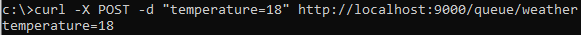
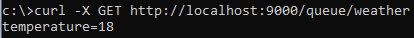
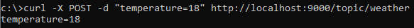
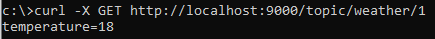

# job4j_pooh

Pooh JMS Project

# About:

<ul>
 <li>This project is analogous to the asynchronous RabbitMQ queue</li>
 <li>The application starts Socket and waits for clients</li>
 <li>There are two types of clients: senders (publisher) and recipients (subscriber)</li>
 <li>HTTP is used as the protocol. Messages in JSON format</li>
 <li>There are two modes: queue, topic</li>
 <li>There is no synchronization in the code. Everything is done on Executors and concurrent collections</li>
</ul>

# Used technologies

<ul>
 <li>JDK 17</li>
 <li>Maven 3.8.5</li>
 <li>Java Concurrency (classes from the java.util.concurrent package)</li>
 <li>Sockets</li>
 <li>Java IO</li>
 <li>GSON 2.9.0</li>
 <li>JUnit 5</li>
</ul>

# Environment requirements

<ul>
 <li>Create .jar file via maven command "mvn package"</li>
 <li>Go to the Target folder and check the presence of "job4j_pooh-1.0-SNAPSHOT.jar" file</li>
 <li>Open the command line, go to the Target folder</li>
 <li>Run this file through "java -jar job4j_pooh-1.0-SNAPSHOT.jar" command</li>
 <li>Install cURL https://curl.se/download.html and set an environment variable for it</li>
 <li>Run command line (Enter "cmd" in Win + R bar)</li>
 <li>Run commands below in command line</li>
</ul>

# Description and screenshots

**Queue**:
The sender sends a request to add data indicating the queue (weather) and parameter value (temperature=18).
The message is placed at the end of the queue. If there is no queue in the service,
a new one creates and put a message in it.
The recipient sends a request to receive data indicating the queue.
The message is taken from the beginning of the queue and deleted.
If several recipients come to the queue, they are receiving messages alternately from the queue.
Each message in the queue can only be received by one recipient.

- Add element in "weather" queue:  
  curl -X POST -d "temperature=18" http://localhost:9000/queue/weather  
  
- Get element from "weather" queue:  
  curl -X GET http://localhost:9000/queue/weather  
  

**Topic**: The sender sends a request to add data indicating the topic (weather) and the parameter value (
temperature=18).
The message is placed at the end of each individual recipient queue. If the topic is not in the service,
then the data is ignored.
The recipient sends a request for data with an indication of the topic.
If there is no topic, then a new one is created. And if the topic is present,
then the message is taken from the beginning of the recipient's individual queue and deleted.
When the recipient receives data from the topic for the first time, an individual empty queue is created for him.
All subsequent messages from senders with data for this topic are placed in this queue too.

- Add element in "weather" topic:  
  curl -X POST -d "temperature=18" http://localhost:9000/topic/weather
  
- Get element with id=1 from "weather" topic:  
  curl -X GET http://localhost:9000/topic/weather/1  
  

***  
Contact me: itfedorovsa@gmail.com